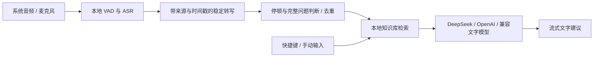

# 本地 ASR 技术路线评估

初次核对日期：2026-09-14。下文保留 1.1.1 时的路线评估背景；后续已实现 SenseVoiceSmall + VAD、BGE-M3 本地向量模型，并在 1.2.2 增加 Paraformer 中英流式识别。当前实现和验收以 [本地模型说明](LOCAL_MODELS.md) 为准。

## 对当前用途的判断

LiveCopilot 的交付形式是文字建议，不需要 AI 说话。建议把 **本地语音识别 + 文字问题判断 + 本地 RAG + 可选文字模型** 作为下一阶段主路线，OpenAI Live 可保留为可选入口。这样录音不必持续上传至 Live，不产生持续的 Live 会话时长费用；本地推理仍消耗 CPU/GPU、内存和电量，文字模型及现有 OpenAI Embeddings 仍可能产生 API 费用。

当前应用里的 `OpenAILiveProvider` 并非只提供转写。它被提示持续理解对话，在问题足够完整时通过 client delegation 触发本地检索和独立文字分析，并识别追问与重复请求。替换成 ASR 时，必须补回这个问题判断环节；VAD 只能检测语音与停顿，不能可靠判断语义是否结束。OpenAI 官方也把 Live 的对话处理与后端推理分开：[Live 架构](https://developers.openai.com/api/docs/guides/live)、[委派提示](https://developers.openai.com/api/docs/guides/live-prompting)。

建议数据流：

实时字幕的 partial 文本可以更新显示，但自动分析只消费稳定结果。中英混说、纠正前一句、长停顿、反问和相同问题的继续补充都需要覆盖。先保留快捷键作为可靠触发方式，再逐步启用自动判断；不能在每个 ASR 分块后立即调用大模型。

## FunASR 的选择

FunASR 是工具箱，不是单个模型。官方模型与部署说明中，各模型的语言范围、流式能力和运行时不同：

| 候选 | 在本项目中的角色 | 需要核对的边界 |
| --- | --- | --- |
| Paraformer-zh-streaming | 中文为主的低延迟流式字幕候选 | 官方列表标注中/英，英文长句、术语和中英混说仍需单独评测；不能从中文结果推断英文准确率。 |
| SenseVoiceSmall + VAD | 本机中英文识别的优先基线 | 支持普通话、英语等；默认是非流式识别，需用短语音片段或滑动窗口实现增量体验。快于音频时长不等同于原生逐词流式。 |
| Fun-ASR-Nano | 中/英/日与中文方言的质量对照候选 | 模型与推理栈更复杂；评估本机运行时间、首段输出、模型常驻成本，不能把服务端 CUDA/vLLM 速度直接套到 Mac。 |

官方来源：[FunASR 模型列表](https://github.com/modelscope/FunASR/blob/main/README_zh.md)、[模型选择指南](https://github.com/modelscope/FunASR/blob/main/docs/model_selection.md)、[SenseVoiceSmall 模型卡](https://huggingface.co/FunAudioLLM/SenseVoiceSmall)、[Fun-ASR-Nano 模型卡](https://huggingface.co/FunAudioLLM/Fun-ASR-Nano-2512)。

## macOS 交付方式

先用独立评测程序挑模型，再考虑原生应用内的稳定集成。优先评估官方 **C++/GGUF** 或可用的 ONNX 路线，把推理作为本机常驻模块，复用 ScreenCaptureKit 与 AVAudioEngine，避免最终用户手动安装 Python、PyTorch 或 Docker。模型首次按需下载，并校验版本、哈希与对应模型许可。

FunASR 已提供 [llama.cpp/GGUF 运行时](https://github.com/modelscope/FunASR/blob/main/runtime/llama.cpp/README.md)，覆盖 SenseVoiceSmall、Paraformer 和 Fun-ASR-Nano；官方描述支持单独二进制和 CPU 推理。不过当前示例以文件输入为主，不能直接当作已经接好 LiveCopilot 的流式模型服务。需要避免逐块重新启动进程和重复加载模型；并分别检查 arm64、x86_64、最低 macOS 版本与资源占用。也不能从“Mac 有 GPU”推断所选算子已经支持 Metal/MPS 加速。

远程会议仍可通过两路音源保持 `Them` / `You` 标签；这与 ASR 模型的说话人分离无关。现场单麦克风仍标记为 `Room`。GGUF 运行时目前没有 CAM++ 说话人聚类，不应承诺它能把现场每个人分开。

## 验证后再切换

用同一组有人工转写的真实场景音频比较候选模型：普通话、英语长句、中英混说、名字/缩写/数字、安静和噪声、远程音频和现场收音。记录中文 CER、英文 WER、关键术语/数字正确率、说完后的出字延迟、首段延迟、实时因子、内存和功耗；单独统计自动建议的误触发、漏触发和重复触发。

本次只完成官方资料与当前代码的路线核对，未下载模型、未跑本机 ASR 性能/准确率测试，不给出未经测量的识别率或加速倍数。

## Apple 原生接口候选（尚未接入）

macOS 26 的 SpeechAnalyzer + SpeechTranscriber 支持本机长时转写和可修正的实时结果，模型资产由系统管理。旧 SFSpeechRecognizer 也能在支持的设备及语言上通过 requiresOnDeviceRecognition 强制本地运行；需要先检查 supportsOnDeviceRecognition。见 [Apple WWDC25](https://developer.apple.com/videos/play/wwdc2025/277/) 和 [本地识别能力检查](https://developer.apple.com/documentation/speech/sfspeechrecognizer/supportsondevicerecognition)。

2026-09-14 在这台 macOS 26.6.2 上实际查询 SpeechTranscriber.supportedLocales，返回 zh_CN、zh_HK、zh_TW，以及 en_US 等英文地区。这只验证接口和语言可用性，未下载 Apple 模型或验证真实识别、中英混说及延迟。若后续接入，应使用运行时能力检查，为应用目前支持的 macOS 14/15 保留现有识别路线。
